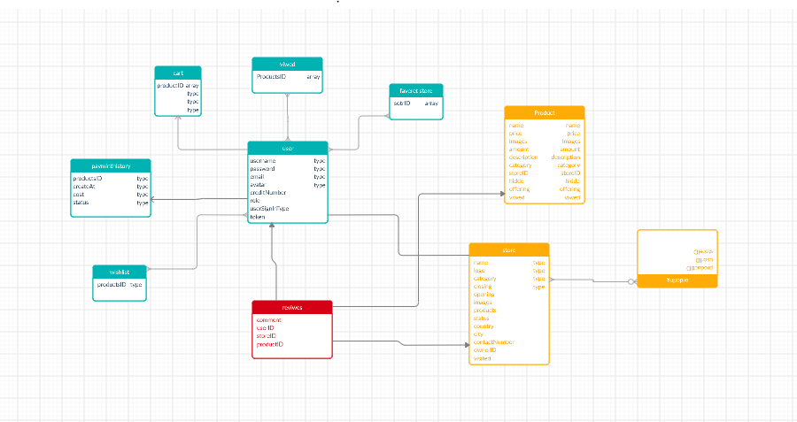

# DAAY-mall

---

## Deployed Link

[DAAY-mall website](https://daaymall-401-project.herokuapp.com/)

---

## Web Application

DAAY-mall is an online platform for stores owners to display and sell their products for users all around the world in an **easy**, **efficient** and **secure** process. The website earns client’s trust with its robust system that verifies stores and a direct customers’ service that have a live chat with website admins offering a continuous feedback.

Users:

- Admins: 
  * Verify stores, customers' service and manage payments and refunds.

- Owners: 
  * Register their stores, add products, manage orders.

- Registered Users:
  * Add to cart and checkout (payment), reviews stores and products and have a favorite stores list and wish list.

- Public Users:
  * Navigate website to view stores and products.


**Minimum MVP** 

- **Authentication features**:
  * Sign-up and sign-in with Facebook.
  * Sign-up and sign-in with Google.
  * Normal signup and sign in.

- **Store registration**:
o The user can add his own store to be registered and then to be verified by the admin (with the ability to shop from other stores).
o When the store is verified the user will be the admin (owner) of his store and he can add employees (for customer service, data entry).
o Their stores can be sub stores.
• Shop
o Each user will have their own cart to add items to.
o Users can search for specific stores or products.
o Users can chat with support agents if they have an inquiry.
o Users can pay online.
• Data Entry
o Add products to the store
• Owner
o Register stores (create)/update store’s info/data
o Add/update employees
o Add/update products to the store
o Chat with customers
o Delete stores

---

## Tools Used

Microsoft Visual Studio

- Node.js
- Express
- Socket.io

---

## Getting Started

Clone this repository to your local machine.

```
git clone https://github.com/YourRepo/YourProject.git
```

Once downloaded, you can either use the dotnet CLI utilities or Visual Studio 2017 (or greater) to build the web application.

```
cd DAAY-mall
`npm i`
```

Install all dependencies needed for the project.

```
Database
```

- explain how to use the database \*

```
cd YourRepo/YourProject
npm start
```

---

<!-- ## Usage

***[Provide some images of your app that shows how it can be used with brief description as title]***

### Overview of Recent Posts


### Creating a Post


### Enriching a Post


### Viewing Post Details


---------------------------

## Data Flow (Frontend, Backend, REST API)

***[Add a clean and clear explanation of what the data flow is. Walk me through it.]***


--------------------------- -->

## Auth/ask for store (UML)


## Data Model

### Overall Project Schema

**_[Add a description of your DB schema. Explain the relationships to me.]_**


---

## Authors

Yazan Alaiwah
Diana Al azzam
Ahmed Abu samaan
Anolla Haddad

---
